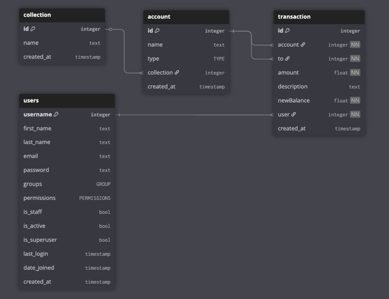

Eine Django-App für die Verwaltung und Buchhaltung von Bezahlkarten-Gutscheinen und Kassen für [Nein zur Bezahlkarte Karlsruhe](https://nein-zur-bezahlkarte-karlsruhe.de/).
Sie kann gerne übernommen und angepasst bzw. erweitert werden.

## Einrichtung
Über das Admin interface können neue User angelegt werden.
Es soltle außerdem eine `collection` mit dem Typ `administrative` angelegt werden.
Dieser sollte ein Konto mit dem Namen "Fehlbetrag" hinzugefügt werden.
Auch "Bargeld" und bspw."Spenden" können dort angelegt werden.

Die restlichen Konten können dann die User selbst anlegen, wenn sie die Berechtigung `core.add_collection` haben.

## Seiten
Die App bietet folgende Seiten an:
- **Admin**: Django Admin Interface für die Verwaltung der App und User. (/admin/)
- **Dashboard**: Übersicht über alle Kassen, deren Kontostände und Transaktionen. Hier können neue Kassen hinzugefügt werden. (/)
- **Kasse**: Übersicht über den Kassenstand einer Kasse. (/?collection_id=XXX)
- **Bearbeiten**: Bearbeiten des Kassenstandes einer Kasse. Hier können die Kassenstände bspw. bei einem Tausch inerhalb der Kasse bearbeitet und neue Gutscheinarten hinzugefügt werden.(/collection/XXX/edit/)
- **Transfer**: Transfer von Gutscheinen/Bargeld von einem Konto/Kasse auf ein anderes. (/collection/XXX/transfer/)
- **Transaktionen**: Übersicht über alle Transaktionen, die durchgeführt wurden. (/transactions/)

## Anwendungen
### Gutscheintausch
Nach einem Gutscheintausch kann der neue Kassenstand eingetragen werden.
Das System errechnet automatisch die passenden Transaktionen.
Sollte es zu einem Fehlbetrag kommen, gibt es eine Warnung.
Dann sollte der Kassenstand kontrolliert werden.
Falls es immer noch zu einem Fehlbetrag kommt, kann dieser nach Bestätigen der Checkbox automatisch dem Fehlbetrag-Konto zugeordnet werden.

## Berechtigungen
Folgende Berechtigungen können gesetzt werden:
- `core.add_account`: Erlaubt Hinzufügen von neuen Gutscheinarten.
- `core.add_collection`: Erlaubt das Hinzufügen von neuen Kassen/Konten.
- `core.change_collection`: Erlaubt das Hinzufügen von Konten.
- `core.view_collection`: Erlaubt das Hinzufügen von Transaktionen.

Es bietet sich an eine Gruppe zu erstellen, die alle Berechtigungen hat, und diese dann den Usern zuzuweisen.

## Datenbank Model
 Das Datenbank Model ist in `core/models.py` zu finden und sieht in etwa so aus:
 
